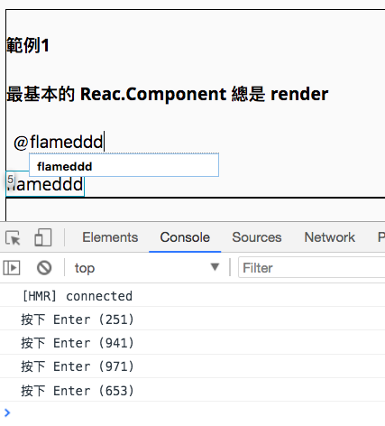
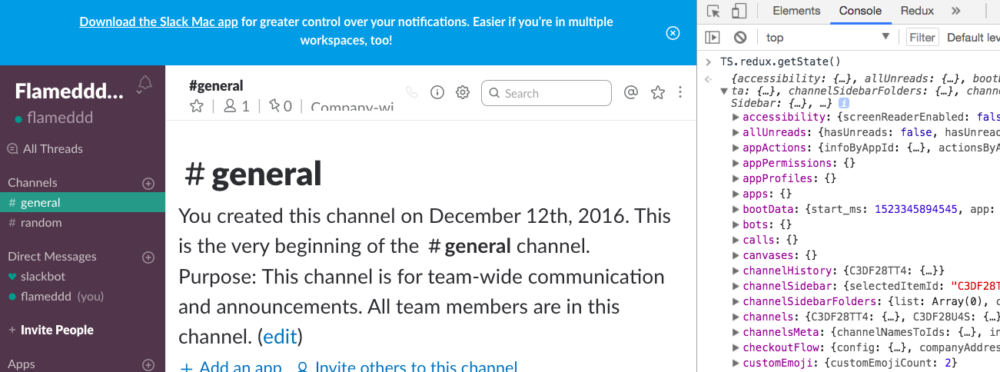
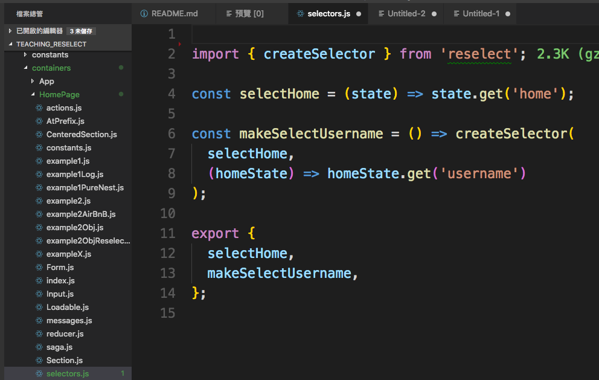

## this example is froked from [react-boilerplate/react-boilerplate](https://github.com/react-boilerplate/react-boilerplate)
# [當天教學影片連結](https://www.youtube.com/watch?v=BTdXpPlBfl0)
# 淺談 react 優化([Avoid Reconciliation](https://reactjs.org/docs/optimizing-performance.html#avoid-reconciliation)) 和 [reselect](https://github.com/reactjs/reselect)。

 - 攻略點　： wasted render、not recomputed unless changed。
 - 發生原因： react (and react-redux) 運作原理 ＋ javascript 語言特性。
 - 解決方法： 變數 memorize 起來。 
 - 適合對象： react 開發新手且正在實際開發。  
 - 講者　　： Jacky。  
 - 預計時間： 1 小時大概...  

## 執行教材範例
```
git clone https://github.com/flameddd/react-boilerplate.git
npm install // 不知道是這個 boilerplate 問題，還是我桌機 yarn 版本問題， yarn install 會失敗。
npm start
visit http://localhost:3000/
```
 - 範例的使用方式幾乎都是 1. focusOn ***input*** 2. onKey 'enter'。  


## 複習 react lifecycle ：
 - <a href="http://dbertella.github.io/react-lifecycle-svg/" target="_blank">react lifecycle</a>
 - 參考：範例1  
 - 上圖這次只關注一個要點，就是只要被 setProps or setState ，就會觸發一連串的 life cycle method。
   1. componentWillReceiveProps(nextProps)
   2. shouldComponentUpdate(nextProps, nextState)
   3. componentWillUpdate(nextProps, nextState)
   4. render()
   5. componentDidUpdate(prevProps, prevState)  

## 定義 wasted render ： 
 - 參考：範例1-1  
 - nextPorps 跟 this.props (or nextStates 跟 this.state) 是一樣的，還是執行 render function 得到上一次一樣的結果。
 
## shouldComponentUpdate(nextProps, nextState) ： 
  - 參考：範例2  
  - 參考：範例2-1  
  - life cycly method 中有個 function 為 ***shouldComponentUpdate*** ，是用來控制是否要執行 render function ，可利用此 method 避免 wasted render 。
```javascript
 shouldComponentUpdate(nextProps) {
   return this.props.username !== nextProps.username
 }
``` 

## JS call by value? call by reference (不深入討論 call by sharing)
 - 參考：範例2-1  
 - call by value 是呼叫變數時，得到的是 ***值*** 。
 - call by reference 是呼叫變數時，得到的是 ***記憶體位置***。
 - Javascript 有 call by value、也有 call by reference
  
| type | call by value | call by refs |
| :------:| :------: | :------: |
| Boolean | Ｏ |  |
| String | Ｏ |  |
| Number | Ｏ |  |
| null | Ｏ |  |
| undefined | Ｏ |  |
| Array |  | Ｏ |
| Object |  | Ｏ |
| Function |  | Ｏ |
  
  
 - ***重點在於，JS 的 「===」、「!==」 比較 values 跟 references 時的差異***
 ```javascript
 const testStr1 = '';
 const testStr2 = '';
 console.log(testStr1 === testStr2) // true 比較 val 是否相同
 const testObj1 = {};
 const testObj2 = {};
 const testObj3 = testObj1;
 console.log(testObj1 === testObj2) // false 比較 ref 是否相同
 console.log(testObj1 === testObj3) // true
 const testArr1 = [];
 const testArr2 = [];
 const testArr3 = testArr1;
 console.log(testArr1 === testArr2) // false 比較 ref 是否相同
 console.log(testArr1 === testArr3) // true
 ```

 - 上面的 table 忘了就算了！！ 需要的時候，用 browser console 自己測一下。
 ```javascript
 let str1 = 'a';
 let str2 = str1;
 str2 = 'b';
 console.log(str1, str2); // a b   <== str1 沒有被 update 、 call by val
 let obj1 = {};
 let obj2 = obj1;
 obj2.a = 'test';
 console.log(obj1); // {a: "test"} <== obj1 被 update 、 call by ref
 ```

## 使用 reselect
 - 使用 reselect 的 createselector 解決範例 2-1 的問題  
 - 參考：範例2-2、範例2-3  
 - [reselect createselector document](https://github.com/reactjs/reselect#createselectorinputselectors--inputselectors-resultfunc)  
 (我直接講解 document 而這邊不多做任何文字說明，是希望未來大家直接去看，因為今天講完，你們忘掉的機率很高。)
 - input selector 的 return 沒變(!== false)，就回傳上一次的結果。
 - input selector 的 return 有變(!== true)，就回傳重新計算的結果(resultFuction return)。
 - syntex：最後一個參數是 resultFunc，其他前面的都是 inputSelectors

```javascript
const mySelector = createSelector(
  state => state.values.value1,
  state => state.values.value2,
  (value1, value2) => value1 + value2
)

// 上面的範例可以理解成下面的

const mySelector = createSelector(
  function(state) {
    return state.order1.total;
  },
  function(state) {
    return state.order2.total;
  },
  function(state) {
    return state.order3.total;
  },
  function(func1_returnVal, func2_returnVal, func3_returnVal) {
    // order1.total + order2.total + order3.total
    return func1_returnVal + func2_returnVal + func3_returnVal;
  }
)

// 用 ES6 語法，我們可以寫成簡化點

const mySelector = createSelector(
  state => state.order1.total,
  state => state.order2.total,
  state => state.order3.total,
  (func1_returnVal, func2_returnVal, func3_returnVal) => (func1_returnVal + func2_returnVal + func3_returnVal);
)
```

 1. 事先定義好 createselector。  
 2. 使用時呼叫它。  
 ```javascript
 const selector = createSelector(
  state => state.username, // "flameddd"
  parameter1 => ({
      name: parameter1
  }));
  ...
  const ChildProps = selector(this.state);
 ```
 - [Airbnb 文章範例 review](https://medium.com/airbnb-engineering/recent-web-performance-fixes-on-airbnb-listing-pages-6cd8d93df6f4)
 ```javascript
 // 直接使用
  const getExperiments = createSelector(
    ({ experimentsFromProps }) => experimentsFromProps,
    ({ experimentsFromState }) => experimentsFromState,
    (experimentsFromProps, experimentsFromState) => ({
      ...experimentsFromProps,
      ...experimentsFromState,
    }),
  );
...
  render() {
    ...
    const finalExperiments = getExperiments({
      experimentsFromProps: experiments,
      experimentsFromState: this.state.experiments,
    });
    return (
      <WrappedComponent
        {...otherProps}
        experiments={finalExperiments}
      />
    );
  }
 ```

# 第１次 Q&A

## ~~redux~~ react-redux ***！！！***
 - 
 - 其實最關鍵的是 [react-redux](https://github.com/reactjs/react-redux) 的 [connect](https://github.com/reactjs/react-redux/blob/master/docs/api.md#connectmapstatetoprops-mapdispatchtoprops-mergeprops-options)的運作方式。
 - redux-react subscription 的對象是 store (redux 就那唯一一顆 store 而已)
 
 - 參考：範例3(addPrefix)  
 - react-redux 執行流程
   1. 只要 store 被改變。
   2. 全部有 connect 的 containers 執行 connect function
      (假如 redux store 裡面有 變數1、變數2、變數3 ... 變數10、共10個變數。  
      有 3 個 (已mount的)containers 分別 connect ({1,2,3}) ({4,5,6}) 跟 ({7,8,9})，當
      變數10 被 update  
      3 個 containers 的各自 connect 都會執行。)  
   3. (全部的) connect 裡面會去重新產生 mapStateToProps
   ```javascript
    const mapStateToProps = state => ({
      visibleToDos1: getVisibleTodos(state.get('todos1')),
      visibleToDos2: getVisibleTodos(state.get('todos2')),
      visibleToDos3: getVisibleTodos(state.get('todos3')),
    })
    export default connect(mapStateToProps, null)(Conatiner1)

    const mapStateToProps = state => ({
      visibleToDos4: getVisibleTodos(state.get('todos4')),
      visibleToDos5: getVisibleTodos(state.get('todos5')),
      visibleToDos6: getVisibleTodos(state.get('todos6')),
    })
    export default connect(mapStateToProps, null)(Conatiner2)

    const mapStateToProps = state => ({
      visibleToDos7: getVisibleTodos(state.get('todos7')),
      visibleToDos8: getVisibleTodos(state.get('todos8')),
      visibleToDos9: getVisibleTodos(state.get('todos9')),
    })
    export default connect(mapStateToProps, null)(Conatiner3)
   ```
   4. 得到新的 mapStateToProps 後，再來去做 ***淺比較(shallow equality comparisons)*** 來判斷(connectAdvanced)要不要(shouldComponentUpdate)執行render function (render children) 

## redux 架構下 reselect 有優化什麼？
  1. stste.get('xxx') 的執行。
  2. addPrefix 的計算。
  3. wasted render

## reselect and mapStateToProps
```javascript
// 1. 沿用舊的寫法
  const mapStateToProps = state => ({
    repos: selectRepos(state),
    username: state.getIn(['home', 'username']),
  });

// 2.mapStateToProps 也可以建立 reselect 
  const mapStateToProps = createStructuredSelector({
    repos: selectRepos,
    username: selectUsername,
  })

// 2 的寫法可以看成是這樣
  // const taxSelector = createSelector(
  //   state => state.getIn(['home', 'repos']),
  //   state => state.getIn(['home', 'username']),
  //   (repos, username) => ({ repos, username })
  // )

// 2-1.如果有的變數還沒有建立 reselect 就這樣寫、語法的問題而已
  const mapStateToProps = createStructuredSelector({
    repos: selectRepos,
    username: state => state.getIn(['home', 'username']),
  })
```

## createSelectorCreator
## defaultMemoize

## reselect 變數命名
 - 參考 reselect 官方 => "變數名稱Selector"
```javascript
  const shopItemsSelector = state => state.shop.items //shopItems + Selector
  const taxPercentSelector = state => state.shop.taxPercent // taxPercent + Selector

// subtotal + Selector
  const subtotalSelector = createSelector(
    shopItemsSelector,
    items => items.reduce((acc, item) => acc + item.value, 0)
  )
// tax + Selector
  const taxSelector = createSelector(
    subtotalSelector,
    taxPercentSelector,
    (subtotal, taxPercent) => subtotal * (taxPercent / 100)
  )
```

## 檔案結構參考
 - 參考 [react-boilerplate/react-boilerplate](https://github.com/react-boilerplate/react-boilerplate)
 - 拆一隻 selectors.js 獨立檔案。



 ### reselect 優點
 - Selectors can compute derived data, allowing Redux to store the minimal possible state.
 - Selectors are efficient. A selector is not recomputed unless one of its arguments changes.
 - Selectors are composable. They can be used as input to other selectors.
 - tl;tr ： 避免 wasted render、減少計算、提供組合性、可減少 state(redux) 使用。

# 第２次 Q&A

## 如果明天我就要玩 reselect ，那該怎麼下手？：
 1. 安裝任一個 react 監控套件。  
 ```javascript
 // 找你自己常用 or 順眼的套件就好，這套只是參考
npm install --save-dev react-global-render-visualizer
 ```
 2. 找個目標來監控。
  - 有 props + state 數量 > 10 左右 (10這數字也是我亂抓的，你覺得大就好)
  - render function 有大量運算 (for loop 去產生 component 之類的)
  - 你覺得慢的 component (肉眼觀察UI行為會卡的)  
  - container 在很上層的位置  
  ```javascript
  // 1. import visualizeRender 進來
  import { visualizeRender } from 'react-global-render-visualizer';

  // 2-1. 可以 @decorator 的方式放在 class 宣告的上一行
  @visualizeRender() 
  class Container extends Component {
    componentDidMount() {
    ...

  // 2-2. 或者在 compose 加入
  const enhance = compose(
    connect(mapStateToProps, mapDispatchToProps),
  　...,
    visualizeRender(),
  );
  export default enhance(Container);

  // 2-3. 直接包
  export default connect(mapStateToProps, mapDispatchProps)(visualizeRender()(Container))
  ```

 3. update 符合預期嗎？
  - 操作看看該 components ， render function 執行的時機符合預期嗎？（這邊用了 預期 這個字眼，代表你應該對該 component 的行為有基本的了解）。  

 4. 沒事最好，但如果有某幾個 props or state 一直重複 trigger render function ：
 - 千萬千萬千萬先別急著想 reselect 。
 - 先去理解 ***此 component*** 的行為是什麼？拿這些 props, state 用來做什麼？
 - 跟 ***該 props or state*** 存的資料格式是？用來做什麼的？
 - 有沒有機會調整 component (自己、上層)結構 or props, state 的取值？(props, state 的資料結構比較難下手，要改資料結構幾乎等於是重構了。)
 - 好好了解trigger ***此 component*** render function 的是什麼變數  

```javascript
  const mapStateToProps = (state, ownProps) => ({
    config: state.get('userConfig'),
  });

  ...
  render () {
    return <div>{this.props.config.enableAccount}</div>
  }
```
 - 最後決定要拿 reselect 來玩的話
 ```javascript
 // 1. 同層目錄下建立 selectors.js 檔案
 // 2. 先直接目標變數 create selector

// selectors.js
import { createSelector } from 'reselect';

//input selector
export const selectFolder = state => state.get('folder');

//selector
export const selectFilter = createSelector(
  selectFolder,
  state => state.get('filter').toJS(),
);

...
// 3. 串接 reselect 到 connect 中
// index.js
import { selectFilter } from './selectors'
 
const mapStateToProps = (state, ownProps) => ({
  filter: selectFilter(state),
});

// 4. 串完後看有沒有改善、再來思考是否有更好的做法、有哪些處理可以拉到 reselect 處理

 ```

 5. 可以抽出來的計算
 - ***此 component*** 的 render function 有沒有運算可以抽出來在 reselect 做掉？
 - mapStateToProps 裡的計算。
 - render function 裡的計算。
 - ``` state.get('config').toJS() ```
  
 6. 別忘了可組合的特性，活用的話可以很強大。
 - state(redux) 的規劃一定不可能完美 fit 每個 container、components 使用情境，隨著新需求的加入，一定有不同的 state 加入。最後會變成 mapStateToProps 傳入好幾個 state ，然後才在 render function 做判斷。
 ```javascript
const mapStateToProps = (state, ownProps) => ({
  lineChart: state.get('line'),
  barChart: state.get('bar'),
  pieChart: state.get('pie'),
});

...
render () {
  const { lineChart, barChart, pieChart } = this.props;
  if (lineChart.loading || barChart.loading || pieChart.loading) {
    return <div>loading</div>
  }
  return <div>Charts</div>
}

const selectLineChart = state => state.get('line');
const selectBarChart = state => state.get('bar');
const selectPieChart = state => state.get('pie');

// ====================================

const loadingSelector = createSelector(
  selectLineChart,
  selectBarChart,
  selectPieChart,
  (line, bar, pie) => line.loading || bar.loading || pie.loading
);

const mapStateToProps = (state) => ({
  loading: loadingSelector(state)
});

...
render () {
  const { loading } = this.props;
  if (loading) {
    return <div>loading</div>
  }
  return <div>Charts</div>
}

 ```

### reselect 兩個情境的處理
 - [想傳變數進去 createselector](https://github.com/reactjs/reselect#q-how-do-i-create-a-selector-that-takes-an-argument)
 - [共用 createselector - reselect範例](https://github.com/reactjs/reselect#sharing-selectors-with-props-across-multiple-component-instances)
 - [共用 createselector - redux 官網的範例](https://redux.js.org/recipes/computing-derived-data#sharing-selectors-across-multiple-components)


# final Q&A, 祝週末愉快～

# react優化推薦閱讀
  就算「你」沒法真的實踐這些優化（時間、實務等考量)，但也能學到很多 react 的優化思維。
 - [React Performance Fixes on Airbnb Listing Pages](https://medium.com/airbnb-engineering/recent-web-performance-fixes-on-airbnb-listing-pages-6cd8d93df6f4)
 - [Performance optimisations for React applications](https://medium.com/@alexandereardon/performance-optimisations-for-react-applications-b453c597b191)
 - [Performance optimisations for React applications: Round 2](https://medium.com/@alexandereardon/performance-optimisations-for-react-applications-round-2-2042e5c9af97)
 - [Dragging React performance forward](https://medium.com/@alexandereardon/dragging-react-performance-forward-688b30d40a33)

  
# 後續ＱＡ回答（update 2018/04/26）
> 回答下面問題之前，我先區分兩的名詞。如果寫著是「render function」，那我指的是 React.Component 裡面的「render function」。  
> 如果寫著「宣染」，那指的是「瀏覽器」的「宣染DOM」行為。
  
## Ｑ： 1. fetch從server的行為怎麼處理，ex request 1000 users from server, return array of object. 我想一定是新物件吧。但大部份的操作都跟server有關，寫todo demo都很方便，那如果我下標一個產品，成功需要refresh頁面(拿到剩下多少件)，每次都拿到新的object沒辨法memory.
## Ａ：
先看看一些官方文件怎麼寫，[reselect](https://github.com/reactjs/reselect#reselect)

> Selectors are efficient. A selector is not recomputed unless one of its arguments changes.

[redux](https://redux.js.org/recipes/computing-derived-data#creating-a-memoized-selector) (這邊可能要點進去看，搭配文字上面區塊的程式碼會更好瞭解)
> We would like to replace `getVisibleTodos` with a memoized selector that recalculates `todos` when the value of `state.todos` or `state.visibilityFilter` changes, but not when changes occur in other (unrelated) parts of the state tree.

這邊可以看到一些關鍵句：
 - `unless one of its arguments changes`
 - `recalculates todos when the value of state.todos or state.visibilityFilter changes`

也就是說，會變動的東西，本來就是要重新計算、取代上一次`cache`。所以用 reslect 的目的是：
 - 當我 `data 沒變`時，你不要重新(計算)產生一次給我。(甚至造成後面的wasted render)  

redux 的架構下，除了上面這點之外，還更是因為 react-redux 運作(請參考上面內容 or 影片)的關係，很有可能繁瑣重複 get data，所造成的浪費。所以你從上面 redux 連結可以看到，它談 reselect 頁面的標題是 `Computing Derived Data`  

>  ... If the state tree is large, or the calculation expensive, repeating the calculation on every update may cause performance problems. Reselect can help to avoid these unnecessary recalculations.


每次取回（剩下的）todo ( = todo list changed)時， reselect 都要重算，這完全正確。但很有可能該 React.Component trigger 的原因不是 todo changed 阿(而是其他原因)，此時 reselect 就有效果。

還有部分的事情我想在Ｑ３回。
  
  
## Ｑ： 2. 承上，reselect是不是要搭配immutable，不然object跟array很難比較
## Ａ：
```
reselect是不是要搭配immutable  == > 對 (這邊指的是 immutable ，而不是指 immtuableJS)
不然object跟array很難比較      == > 不對
```
一樣在看看官方文件 
[reslect's createSelector](https://github.com/reactjs/reselect#createselectorinputselectors--inputselectors-resultfunc)

> createSelector determines if the value returned by an input-selector has changed between calls using reference equality (===). Inputs to selectors created with createSelector should be immutable.

這邊採用 `immutable` 的目的是為了`(基於JS語言特性下)正確的被比較`。可以看到 reselect 的 FQA 第１條就是寫 [Q: Why isn’t my selector recomputing when the input state changes?](https://github.com/reactjs/reselect#q-why-isnt-my-selector-recomputing-when-the-input-state-changes)

> ... Note that if you are using Redux, mutating the state object is [almost certainly a mistake.](https://redux.js.org/troubleshooting)  
  
所以這邊我覺得用「`難`」拿描述不太對，而是 `能否(如我們人類所想的)正確被比較`。  
不知道我有沒有誤會你所指的「`難`」，因為`比較`就是用`===`來處理，用不用 `immutable` 這邊都不會有差。如果我搞錯了，但你也能理解我這段的表達。我們就先別糾結「`難`」這詞義吧 >.<
  
  
## Ｑ： 3. 進到render真的差很多嗎(假設render裡面沒有複雜計算，單純render props & state) 。[React 性能優化大挑戰：一次理解 Immutable data 跟 shouldComponentUpdate](https://blog.techbridge.cc/2018/01/05/react-render-optimization/) 這篇文章寫，有可能觸發render但實際dom沒有任何操作，我是對這文章感到有點疑惑啦，畢竟額外比較也是需要cost的，不然就全部deep equal就好了。
## Ａ：
  我只喵了一下techbridge的內容（沒詳讀），依我看到的那段沒錯的話，那段結論是「對的」。這邊要談的是 「render function」之後的流程為：
```
  1. 執行「render function」得到一個 return 值
  2. 拿「return 值(virtual DOM) 去跟「(真正的DOM)」做「差異化比較」。
  3. 如果 2. 的結果是「有差異」，重新「宣染有差異的DOM」
  4. 如果 2. 的結果是「沒差異」， do nothing。
```
依 techbridge 的舉例
App.js 的 `前`、`後` return 都是
```javascript
<div>
  <button onClick={this.handleClick}>setState</button>
  <Content />
</div>
```
Content.js 的 `前`、`後` return 都是
```javascript
<div>Content</div>
```

都沒變啊，所以跟 DOM 比較起來也「不會有差異」 ＝＞ 當然就「不宣染」了。  
承Ｑ１的問題，假如你先讀了 50 筆 todos ，而且已經「宣染」在瀏覽器上了。接者你再載入 51 ~ 100 筆的資料，此時情況為：
```
1. 執行「render function」得到一個 return 值
2. 拿「return 值(virtual DOM) 去跟「(真正的DOM)」做「差異化比較」。
3. 如果 2. 的結果是「有差異」，重新「宣染有差異的DOM」
```
注意！「宣染`有差異`的DOM」，也就是說真正有被「宣染」行為 update 的只有「51 ~ 100筆」這些新資料而已。(這就是為什麼 動態產生的 DOM ，它會要求你給 key 值。 react 會用來判斷，key有沒有變動。)

接著談這個問題 `進到render真的差很多嗎` ，如果真的這麼單純的話，「`不會！`」。
我們換個角度來想想這個問題，為什麼 react 會提供可以使用 `stateless function`，跟 `PureComponent`還有`Component`之間有什麼微妙的差異。

`stateless function` 除了不會執行 life cycle method 之外，它「一定」會 執行 跟 return 。  
`PureComponent` 一定會執行到`shouldComponetUpdate` ，不一定會執行到 render func。  
`Component` (預設)一定會執行到 render func。  
  
如果今天 `stateless function` 只有著「一點點的運算」，但你有 100 筆 todos。  
 1. (stateless)那 「一點點的運算」＊100 ＋ return 100 後的差異化比較
 2. (PureComponent)100 次比較 nextProps.todoTitle !== this.props.todoTitle  

哪種情況比較浪費呢？我沒有精準的答案！，因為「一點點的運算」，根本是個未知。真正要看這樣問題時，一定要用工具來看看執行時間。  
（這時候就要跪拜感謝 Chrome 的 devtool 了ＱＱ，上面的推薦閱讀 Airbnb 那篇就是這樣來判斷很多情況的！這邊再推薦一次）  
  
然而如果(props or states)情況是「經常性變動」呢？`PureComponent` 就會變成
```
100 次比較 nextProps.todoTitle !== this.props.todoTitle ＋
「一點點的運算」＊100 ＋
render return 100 後的差異化比較
```
這樣的情況下，感覺又不一樣了！！，所以 techbridge 的文章才會提及 `PureComponent` 使用也是有它的議題的。
